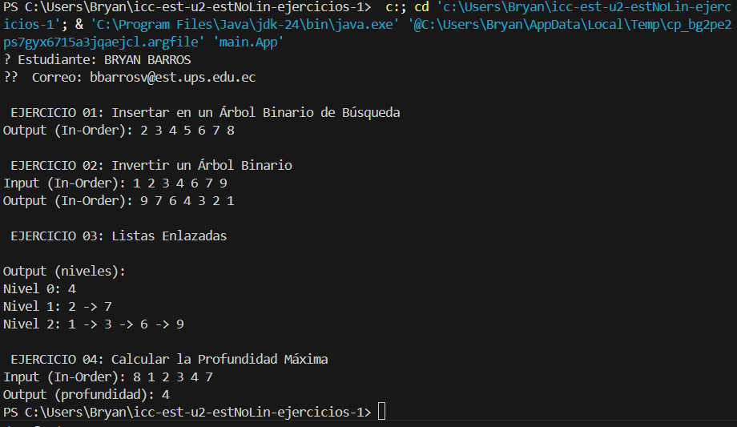

# Estructuras No Lineales – Ejercicios Árboles

Este proyecto contiene la solución a cuatro ejercicios prácticos sobre estructuras de datos tipo árbol binario, como parte del aprendizaje de estructuras no lineales en Java. Cada ejercicio se encuentra organizado en su propia carpeta, siguiendo la convención de paquetes y buenas prácticas.

---

## 📌 Identificación del Estudiante (Obligatorio)
- **Título:** Estructuras No Lineales
- **Asignatura:** Estructura de Datos
- **Carrera:** Computación
- **Estudiante:** Bryan Barros
- **Fecha:** 07/07/2025
- **Profesor:** Ing. Pablo Torres

---
## 🎯 Objetivo
Aplicar y reforzar los conocimientos sobre estructuras de datos no lineales, mediante la implementación de algoritmos fundamentales con árboles binarios en Java.
Se desarrollaron ejercicios prácticos que abarcan inserción en árboles binarios de búsqueda (BST), inversión de árboles, recorrido por niveles y cálculo de profundidad máxima, fomentando el pensamiento lógico, el análisis recursivo y el manejo eficiente de estructuras enlazadas.

URL del Repositorio:https://github.com/Bryan-BarrosV/icc-est-u2-estNoLin-ejercicios.git
---

## 📊 Resultado Final



## Explicación para el estudiante

```
src/
│
├── Materia/
│
├── Ejercicio_01_insert/
├── Ejercicio_02_invert/
├── Ejercicio_03_listLeves/
└── Ejercicio_04_depth/
```

---

## Descripción de Ejercicios

### Ejercicio 01: Insertar en un Árbol Binario de Búsqueda (BST)

Carpeta: `Ejercicio_01_insert`
Implementa un algoritmo para insertar nodos en un Árbol Binario de Búsqueda.

 **Input de ejemplo:** `[5, 3, 7, 2, 4, 6, 8]`
 **Output esperado:**

```
    5
  3   7
 2 4 6 8
```

---

### Ejercicio 02: Invertir un Árbol Binario

📂 Carpeta: `Ejercicio_02_invert`
Dada la raíz de un árbol binario, el algoritmo devuelve su versión invertida (espejo).

 **Input de ejemplo:**

```
    4
  2   7
1  3 6  9
```

**Output esperado:**

```
    4
  7   2
9  6 3  1
```

---

### Ejercicio 03: Listar Niveles en Listas Enlazadas

📂 Carpeta: `Ejercicio_03_listLeves`
Devuelve una lista enlazada con los nodos por nivel. Si hay N niveles, se obtienen N listas.

 **Input de ejemplo:**

```
    4
  2   7
1  3 6  9
```

**Output esperado:**

```
4  
2 → 7  
1 → 3 → 6 → 9
```

---

### Ejercicio 04: Calcular la Profundidad Máxima

Carpeta: `Ejercicio_04_depth`
Calcula la profundidad máxima de un árbol binario (la longitud del camino más largo desde la raíz hasta una hoja).

**Input de ejemplo:**

```
    4
  2   7
1  3  
8
```

**Output esperado:** `4`

---

## Indicaciones Generales

* Lee cuidadosamente el enunciado de cada ejercicio.
* Cada carpeta debe contener:

  * Código fuente Java.
  * Casos de prueba.
  * Comentarios claros.
* Realiza commit y push con el mensaje:

  ```
  Estructuras No Lineales – Ejercicios Árboles
  ```
* En el AVAC, sube la **URL del repositorio** con el código.

---

## No se calificará si:

* No hay commit con los ejercicios.
* No se incluye este README explicativo.
* Las clases o métodos no siguen los nombres requeridos.

---

## Rúbrica de Calificación

| **Criterio**       | **Descripción**                                                                       | **Puntaje** |
| ------------------ | ------------------------------------------------------------------------------------- | ----------- |
| **Informe**        | No hay informe                                                                        | 0 pts       |
|                    | Informe parcial **sin explicación** de cada método                                    | 1 pt        |
|                    | Informe parcial **con explicación** de cada método                                    | 2 pts       |
|                    | Informe completo                                                                      | 3 pts       |
| **Funcionamiento** | No implementado                                                                       | 0 pts       |
|                    | Implementado parcialmente: <br>• Ejercicio 1 y 4 → 2 pts<br>• Ejercicio 2 y 3 → 4 pts | 2–4 pts     |
|                    | Código funcional pero **no pasa todas las pruebas**                                   | 6 pts       |
|                    | Código funcional y **pasa todas las pruebas correctamente**                           | 7 pts       |


## Contribuir

Para contribuir a este proyecto, por favor crea un fork y envía una solicitud de extracción, o simplemente abre un issue con tus comentarios y sugerencias.

## Autores

- [PABLO TORRES] - Desarrollo inicial

